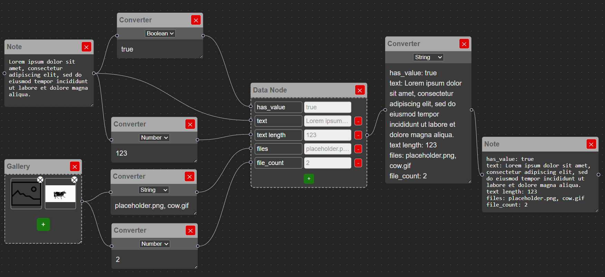

# MindCanvas

MindCanvas is a web-based visual note-taking application that lets you think, connect, and organize your ideas spatially. Designed as an interactive canvas, it enables users to create various types of notes (text, images, json-like structures) and connect them visually using links — much like building a mind map or a concept board.

> ⚡ Built with React, TypeScript, and powered by [xyflow](https://reactflow.dev/), this tool is ideal for brainstorming, visual documentation, and personal knowledge management.

---

## ✨ Features

- 🧱 **Multiple Note Types**:
  - Text notes
  - Image notes
  - Converter
  - JSON-like blocks

- 🎯 **Freeform Canvas**:
  - Drag-and-drop positioning
  - Resizable workspace
  - Clean, distraction-free interface

- 🔗 **Visual Connections**:
  - Draw links between notes
  - Represent relationships

---

| Canvas with text, image, converter and data notes |
|----------------------------------------|
|  |

| An example of node interaction |
|--------------------------|
|  |


## 🚀 Tech Stack

- **Frontend**: React + TypeScript
- **UI / Canvas**: [xyflow](https://reactflow.dev/)

---

## 🎯 Use Cases

- Visual thinking and brainstorming
- Knowledge mapping
- Idea clustering
- Research and note organization

---

## 🛠 Installation & Local Run

1. Clone the repository:
   ```bash
   git clone https://github.com/IvanAfanasiev/MindCanvas.git
   cd MindCanvas
   ```
2. Install dependencies:
```
npm install
```
3. Start the development server:
```npm run dev```
4. Open your browser and navigate to:
[localhost](http://localhost:5173)

Make sure you have Node.js and npm installed on your system.


## 🧪 Status

This is an MVP version built for portfolio purposes, showcasing interactive UI design, custom canvas logic, and modern frontend development with React + TS.